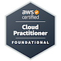

### 💡 **Latest articles**:

<!-- BLOG-POST-LIST:START -->
- [I passed the AWS Certified Cloud Practitioner in 7 days — Here’s How](https://pietrzakadrian.com/blog/i-passed-the-aws-certified-cloud-practitioner-in-7-days-here-is-how)
- [Software Development &amp; Programming Tools in 2022](https://pietrzakadrian.com/blog/software-development-and-programming-tools-in-2022)
- [NestJS Authentication Series 🔐: Part 1 - User registration](https://pietrzakadrian.com/blog/nestjs-authentication-series/user-registration)
- [Accelerate the purchasing 🛍 process in e-commerce based on Shopware 6](https://pietrzakadrian.com/blog/accelerate-the-purchasing-process-in-e-commerce-based-on-shopware-6)
- [How to create a microservice that handles 🎢 the queue of sending emails in NestJS](https://pietrzakadrian.com/blog/how-to-create-a-microservice-that-handles-the-queue-of-sending-emails-in-nestjs)
<!-- BLOG-POST-LIST:END -->

➡️ [more articles...](https://pietrzakadrian.com/blog)

### 🏅 **Certificates**:

